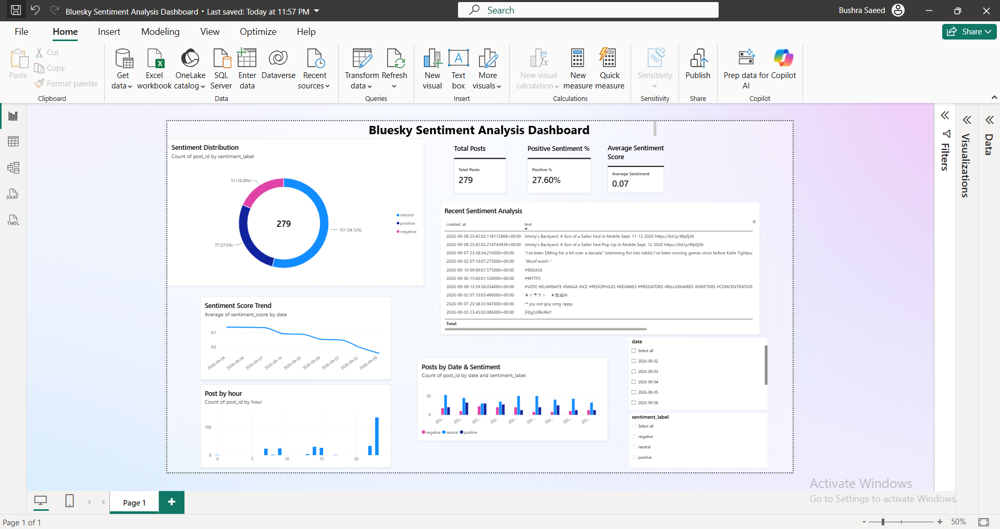

# Bluesky Sentiment Analysis Dashboard

An end-to-end, automated data pipeline that ingests live posts from Bluesky, scores sentiment with VADER, and lands the results in a Power BI dashboard — refreshed every 15 minutes without any manual step.

[](https://www.python.org/)
[](https://aws.amazon.com/)
[](https://powerbi.microsoft.com/)
[](#automation)

**Pipeline:** `Bluesky Jetstream → AWS EC2 → VADER Sentiment Analysis → Amazon S3 → Amazon Athena → Power BI`

---

## Dashboard



**Live snapshot:**

| Metric | Value |
|---|---|
| Total posts analyzed | 279 |
| Positive sentiment | 27.6% |
| Average sentiment score | 0.07 |

---

## Why this project

Most sentiment analysis demos run once on a static export. This one is a live system: it taps Bluesky's Jetstream directly, scores every post the moment it's ingested, and keeps a Power BI report current on a schedule — with no manual re-runs. It's a small but complete example of a real streaming-analytics stack: **ingestion → processing → data lake → SQL layer → BI**, built solo end to end.

## Architecture

```text
                    ┌──────────────────┐
                    │     Bluesky      │
                    │    Jetstream     │
                    └────────┬─────────┘
                             │
                             ▼
                    ┌──────────────────┐
                    │    AWS EC2       │
                    │  Python Pipeline │
                    └────────┬─────────┘
                             │
                  ┌──────────┴──────────┐
                  │                     │
                  ▼                     ▼
        ┌──────────────────┐   ┌──────────────────┐
        │ VADER Sentiment  │   │   Raw JSON Data  │
        │    Analysis      │   │                  │
        └────────┬─────────┘   └────────┬─────────┘
                 │                      │
                 └──────────┬───────────┘
                            ▼
                    ┌──────────────────┐
                    │    Amazon S3     │
                    │ Data Lake/Store  │
                    └────────┬─────────┘
                             │
                             ▼
                    ┌──────────────────┐
                    │  Amazon Athena   │
                    │   SQL Analytics  │
                    └────────┬─────────┘
                             │
                             ▼
                    ┌──────────────────┐
                    │     Power BI     │
                    │    Dashboard     │
                    └──────────────────┘
```

## Key features

- Live Bluesky post ingestion via Jetstream
- VADER sentiment scoring — positive / negative / neutral classification with polarity from −1 to +1
- Raw JSON and processed analytics CSV, both partitioned by date in S3
- SQL analytics over the data lake via Amazon Athena
- Fully automated: runs every 15 minutes via Linux cron, no manual execution
- Interactive Power BI dashboard with date and sentiment filtering, trend analysis, and hourly activity breakdown

## Technologies used

| Technology | Purpose |
|---|---|
| Python | Data ingestion and processing |
| Bluesky Jetstream | Live social media data source |
| VADER | Sentiment analysis |
| Pandas | Data processing |
| Boto3 | AWS integration |
| AWS EC2 | Pipeline execution |
| Amazon S3 | Data storage |
| Amazon Athena | SQL analytics |
| Power BI | Data visualization |
| Linux Cron | Pipeline scheduling |
| Git & GitHub | Version control |

## Data pipeline

**1. Ingestion** — Connects to Bluesky Jetstream and listens for newly created posts. Each record captures post ID, author DID, post text, and creation timestamp.

**2. Sentiment analysis** — VADER computes a compound score per post:

- `>= 0.05` → Positive
- `<= -0.05` → Negative
- Between → Neutral

Each processed record stores the sentiment label plus compound, positive, neutral, and negative scores.

**3. S3 storage** — Data is partitioned by date:

```text
s3://twitter-sentiment-pipeline-bushra-2026/
├── raw/
│   └── date=YYYY-MM-DD/
│       └── bluesky_YYYYMMDDTHHMMSSZ.json
├── analytics/
│   └── date=YYYY-MM-DD/
│       └── bluesky_sentiment.csv
└── athena-results/
```

**4. Amazon Athena** — Queries the processed data directly from S3.

- Database: `bluesky_db`
- Table: `sentiment`

```sql
SELECT
    sentiment_label,
    COUNT(*) AS post_count,
    AVG(sentiment_score) AS average_sentiment
FROM bluesky_db.sentiment
GROUP BY sentiment_label;
```

## Automation

The pipeline runs unattended every 15 minutes via cron:

```
*/15 * * * *
```

## Project structure

```text
bluesky-sentiment-analysis/
│
├── assets/
│   └── dashboard.png
│
├── src/
│   ├── ingestion/
│   │   ├── bluesky_client.py
│   │   └── jetstream_client.py
│   ├── processing/
│   │   └── sentiment_processor.py
│   ├── storage/
│   │   └── s3_uploader.py
│   └── pipeline.py
│
├── tests/
│   ├── test_bluesky.py
│   ├── test_jetstream.py
│   ├── test_s3_pipeline.py
│   └── test_sentiment.py
│
├── requirements.txt
├── s3_test.py
├── .gitignore
└── README.md
```

## Running the project

```bash
# install dependencies
pip install -r requirements.txt

# run the pipeline
python3 -m src.pipeline
```

The pipeline listens for Bluesky posts, processes them, saves the analytics dataset, and uploads results to S3.

## Testing

Covers Bluesky ingestion, Jetstream connection, sentiment processing, and S3 pipeline functionality.

```bash
pytest
```

## Future improvements

- Replace batch collection with continuous streaming
- Add transformer-based sentiment classification
- Add topic and keyword extraction
- Add language detection
- Add sentiment alerts
- Automated Power BI Service refresh
- Improve data partition management
- Add monitoring and error notifications

## Author

**Bushra Khan**
GitHub: [https://github.com/Bushra-git](https://github.com/Bushra-git)
